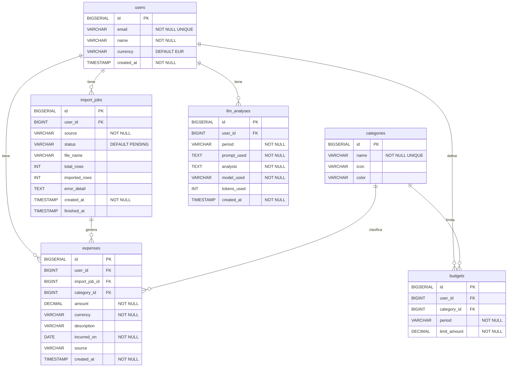

---
config:
  theme: redux-dark-color
---

```mermaid
erDiagram
    users {
        BIGSERIAL id PK
        VARCHAR email "NOT NULL UNIQUE"
        VARCHAR name "NOT NULL"
        VARCHAR currency "DEFAULT EUR"
        TIMESTAMP created_at "NOT NULL"
    }

    categories {
        BIGSERIAL id PK
        VARCHAR name "NOT NULL UNIQUE"
        VARCHAR icon
        VARCHAR color
    }

    import_jobs {
        BIGSERIAL id PK
        BIGINT user_id FK
        VARCHAR source "NOT NULL"
        VARCHAR status "DEFAULT PENDING"
        VARCHAR file_name
        INT total_rows
        INT imported_rows
        TEXT error_detail
        TIMESTAMP created_at "NOT NULL"
        TIMESTAMP finished_at
    }

    expenses {
        BIGSERIAL id PK
        BIGINT user_id FK
        BIGINT import_job_id FK
        BIGINT category_id FK
        DECIMAL amount "NOT NULL"
        VARCHAR currency "NOT NULL"
        VARCHAR description
        DATE incurred_on "NOT NULL"
        VARCHAR source
        TIMESTAMP created_at "NOT NULL"
    }

    budgets {
        BIGSERIAL id PK
        BIGINT user_id FK
        BIGINT category_id FK
        VARCHAR period "NOT NULL"
        DECIMAL limit_amount "NOT NULL"
    }

    llm_analyses {
        BIGSERIAL id PK
        BIGINT user_id FK
        VARCHAR period "NOT NULL"
        TEXT prompt_used "NOT NULL"
        TEXT analysis "NOT NULL"
        VARCHAR model_used "NOT NULL"
        INT tokens_used
        TIMESTAMP created_at "NOT NULL"
    }

    users ||--o{ import_jobs : "tiene"
    users ||--o{ expenses : "tiene"
    users ||--o{ budgets : "define"
    users ||--o{ llm_analyses : "tiene"
    import_jobs ||--o{ expenses : "genera"
    categories ||--o{ expenses : "clasifica"
    categories ||--o{ budgets : "limita"
```
