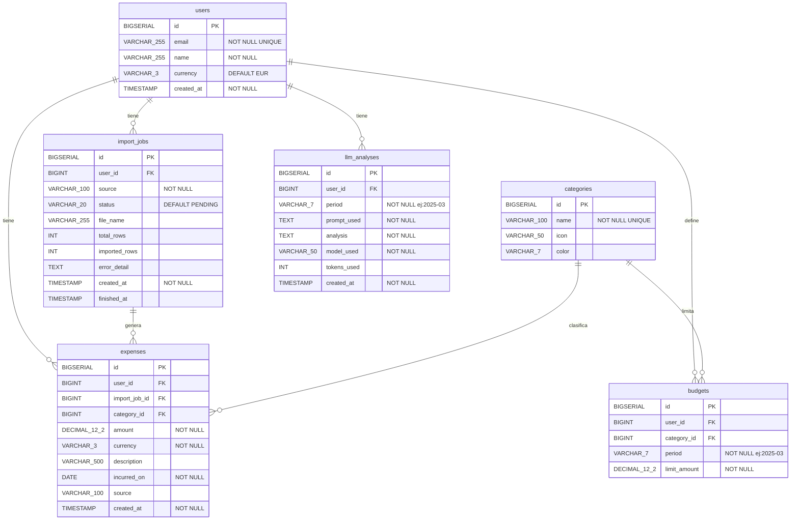

# Modelo de Datos — Aureus

## Diagrama Relacional



---

## Descripción de Tablas

### `users`

Es la tabla central de la que cuelga todo. Aunque se empiece sin sistema de login real, tenerla desde el principio es importante porque todas las demás tablas referencian `user_id`. Si se añade tarde hay que reescribir migraciones Flyway ya ejecutadas, lo cual es un problema serio.

El campo `currency` guarda la moneda preferida del usuario (`EUR`, `USD`…) para que el dashboard no tenga que inferirla gasto a gasto. `created_at` es buena práctica en toda tabla — ayuda a depurar y en el futuro a ordenar registros cronológicamente.

| Campo | Tipo | Restricciones |
|---|---|---|
| `id` | `BIGSERIAL` | `PRIMARY KEY` |
| `email` | `VARCHAR(255)` | `NOT NULL UNIQUE` |
| `name` | `VARCHAR(255)` | `NOT NULL` |
| `currency` | `VARCHAR(3)` | `DEFAULT 'EUR'` |
| `created_at` | `TIMESTAMP` | `NOT NULL DEFAULT NOW()` |

---

### `categories`

Existe para evitar el problema del `VARCHAR` libre. Sin esta tabla, `"Groceries"`, `"groceries"` y `"GROCERIES"` serían tres categorías distintas en las queries del dashboard, lo que rompería las agrupaciones y las gráficas.

`name` tiene `UNIQUE` para que no se puedan insertar duplicados. `icon` y `color` son opcionales pero muy útiles para el frontend — en lugar de que React decida qué color pintar cada categoría, queda centralizado en base de datos. Se puede pre-poblar en una migración Flyway con las categorías estándar de Revolut (`Transport`, `Eating Out`, `Groceries`…) para que el parser del CSV las encuentre directamente.

| Campo | Tipo | Restricciones |
|---|---|---|
| `id` | `BIGSERIAL` | `PRIMARY KEY` |
| `name` | `VARCHAR(100)` | `NOT NULL UNIQUE` |
| `icon` | `VARCHAR(50)` | nullable |
| `color` | `VARCHAR(7)` | nullable — formato hex `#10b981` |

---

### `import_jobs`

Registra cada vez que el usuario sube un CSV. Tiene dos propósitos principales.

El primero es **trazabilidad**: si algo falla durante la importación, `status` pasa a `FAILED` y `error_detail` guarda el mensaje de error. Así el usuario ve en el historial qué CSVs se importaron bien y cuáles fallaron, en lugar de que el error desaparezca silenciosamente.

El segundo es **integridad**: al vincular cada gasto a su `import_job_id`, se puede implementar fácilmente la funcionalidad de "deshacer importación" — simplemente borrando todos los `expenses` donde `import_job_id = X`. Sin esta tabla habría que borrar por fechas o por lotes, lo cual es mucho más frágil.

`source` identifica el origen del CSV (`revolut`, `n26`, `manual`) porque cada banco exporta columnas con nombres distintos y el parser necesita saber qué formato esperar. `total_rows` e `imported_rows` permiten mostrar un resumen del tipo *"se importaron 47 de 50 filas"*.

| Campo | Tipo | Restricciones |
|---|---|---|
| `id` | `BIGSERIAL` | `PRIMARY KEY` |
| `user_id` | `BIGINT` | `NOT NULL FK → users` |
| `source` | `VARCHAR(100)` | `NOT NULL` — `revolut`, `n26`, `manual` |
| `status` | `VARCHAR(20)` | `DEFAULT 'PENDING'` — `PENDING`, `PROCESSING`, `DONE`, `FAILED` |
| `file_name` | `VARCHAR(255)` | nullable |
| `total_rows` | `INT` | nullable |
| `imported_rows` | `INT` | nullable |
| `error_detail` | `TEXT` | nullable |
| `created_at` | `TIMESTAMP` | `NOT NULL DEFAULT NOW()` |
| `finished_at` | `TIMESTAMP` | nullable |

---

### `expenses`

El corazón del sistema. Cada fila es un gasto individual tal como viene del CSV de Revolut o como lo introduce el usuario manualmente.

`import_job_id` es nullable a propósito — un gasto manual no viene de ningún CSV, así que no tiene job asociado. Esto permite tener ambos tipos de gasto en la misma tabla sin forzar una relación que no siempre existe.

`category_id` referencia `categories` en lugar de guardar el nombre directamente. El parser del CSV lee la columna de categoría de Revolut, busca la categoría correspondiente en la tabla `categories` y guarda el `id`. Si no la encuentra, puede crearla on-the-fly o asignar una categoría por defecto.

`incurred_on` es `DATE` y no `TIMESTAMP` porque para el análisis de gastos la hora exacta no importa — lo que importa es el día. Esto simplifica todas las queries del dashboard que agrupan por mes.

| Campo | Tipo | Restricciones |
|---|---|---|
| `id` | `BIGSERIAL` | `PRIMARY KEY` |
| `user_id` | `BIGINT` | `NOT NULL FK → users` |
| `import_job_id` | `BIGINT` | nullable `FK → import_jobs` |
| `category_id` | `BIGINT` | `NOT NULL FK → categories` |
| `amount` | `DECIMAL(12,2)` | `NOT NULL` |
| `currency` | `VARCHAR(3)` | `NOT NULL` |
| `description` | `VARCHAR(500)` | nullable |
| `incurred_on` | `DATE` | `NOT NULL` |
| `source` | `VARCHAR(100)` | nullable |
| `created_at` | `TIMESTAMP` | `NOT NULL DEFAULT NOW()` |

**Índices:**

```sql
CREATE INDEX idx_expenses_user_month    ON expenses(user_id, incurred_on);
CREATE INDEX idx_expenses_user_category ON expenses(user_id, category_id);
```

Sin ellos, cada query del dashboard haría un full scan de toda la tabla. Con ellos, PostgreSQL filtra directamente por usuario y rango de fechas.

---

### `budgets`

Permite que el usuario defina cuánto quiere gastar en cada categoría cada mes. La combinación `(user_id, category_id, period)` tiene restricción `UNIQUE` — no tiene sentido tener dos presupuestos para la misma categoría en el mismo mes.

Su valor real aparece cuando se cruza con `expenses` en una sola query:

```sql
SELECT
    c.name,
    b.limit_amount,
    COALESCE(SUM(e.amount), 0)                          AS spent,
    b.limit_amount - COALESCE(SUM(e.amount), 0)         AS remaining
FROM budgets b
JOIN categories c ON c.id = b.category_id
LEFT JOIN expenses e
    ON  e.category_id = b.category_id
    AND e.user_id     = b.user_id
    AND TO_CHAR(e.incurred_on, 'YYYY-MM') = b.period
WHERE b.user_id = :userId
  AND b.period  = :period
GROUP BY c.name, b.limit_amount;
```

Esto devuelve exactamente lo que se necesita para mostrar en el dashboard cuánto queda de cada presupuesto, y le da al LLM información mucho más rica: no solo *"gastaste 340 € en restaurantes"* sino *"gastaste 340 € en restaurantes, un 70 % más de lo que tenías presupuestado"*.

| Campo | Tipo | Restricciones |
|---|---|---|
| `id` | `BIGSERIAL` | `PRIMARY KEY` |
| `user_id` | `BIGINT` | `NOT NULL FK → users` |
| `category_id` | `BIGINT` | `NOT NULL FK → categories` |
| `period` | `VARCHAR(7)` | `NOT NULL` — formato `yyyy-MM`, ej: `2025-03` |
| `limit_amount` | `DECIMAL(12,2)` | `NOT NULL` |

**Restricción única:**

```sql
UNIQUE (user_id, category_id, period)
```

---

### `llm_analyses`

Guarda la respuesta de OpenAI para no llamar a la API cada vez que el usuario abre el dashboard. La restricción `UNIQUE (user_id, period)` garantiza que solo existe un análisis por usuario y mes.

`prompt_used` almacena el prompt exacto que se envió a GPT. Esto tiene dos ventajas prácticas: permite depurar por qué el modelo dio una respuesta concreta, y en la memoria del TFG se puede mostrar exactamente cómo se construye el prompt con los datos reales del usuario.

`tokens_used` permite calcular el coste aproximado de cada análisis si en algún momento se quiere controlar o mostrar al usuario.

La lógica en el backend sería: cuando el usuario pide el análisis de un mes, primero se busca en `llm_analyses` si ya existe uno para ese `(user_id, period)`. Si existe, se devuelve directamente. Si no existe, se agregan los datos de `expenses`, se construye el prompt, se llama a OpenAI, se guarda la respuesta y se devuelve. Así la API de OpenAI solo se llama **una vez por mes y usuario**.

| Campo | Tipo | Restricciones |
|---|---|---|
| `id` | `BIGSERIAL` | `PRIMARY KEY` |
| `user_id` | `BIGINT` | `NOT NULL FK → users` |
| `period` | `VARCHAR(7)` | `NOT NULL` — formato `yyyy-MM` |
| `prompt_used` | `TEXT` | `NOT NULL` |
| `analysis` | `TEXT` | `NOT NULL` |
| `model_used` | `VARCHAR(50)` | `NOT NULL DEFAULT 'gpt-4.1'` |
| `tokens_used` | `INT` | nullable |
| `created_at` | `TIMESTAMP` | `NOT NULL DEFAULT NOW()` |

**Restricción única:**

```sql
UNIQUE (user_id, period)
```

---

## Resumen de Relaciones

| Relación | Tipo | Significado |
|---|---|---|
| `users` → `import_jobs` | 1:N | Un usuario sube muchos CSVs |
| `users` → `expenses` | 1:N | Un usuario tiene muchos gastos |
| `users` → `budgets` | 1:N | Un usuario define muchos presupuestos |
| `users` → `llm_analyses` | 1:N | Un usuario tiene un análisis por mes |
| `import_jobs` → `expenses` | 1:N | Un CSV genera muchos gastos |
| `categories` → `expenses` | 1:N | Una categoría clasifica muchos gastos |
| `categories` → `budgets` | 1:N | Una categoría puede tener presupuesto por mes |

---

## Migraciones Flyway

El orden de creación respeta las dependencias entre tablas (no se puede crear una FK antes que la tabla referenciada):

```
V1__create_users.sql
V2__create_categories.sql
V3__create_import_jobs.sql
V4__create_expenses.sql
V5__create_budgets.sql
V6__create_llm_analyses.sql
V7__seed_categories.sql       ← categorías estándar de Revolut
V8__seed_test_user.sql        ← opcional, solo para desarrollo
```