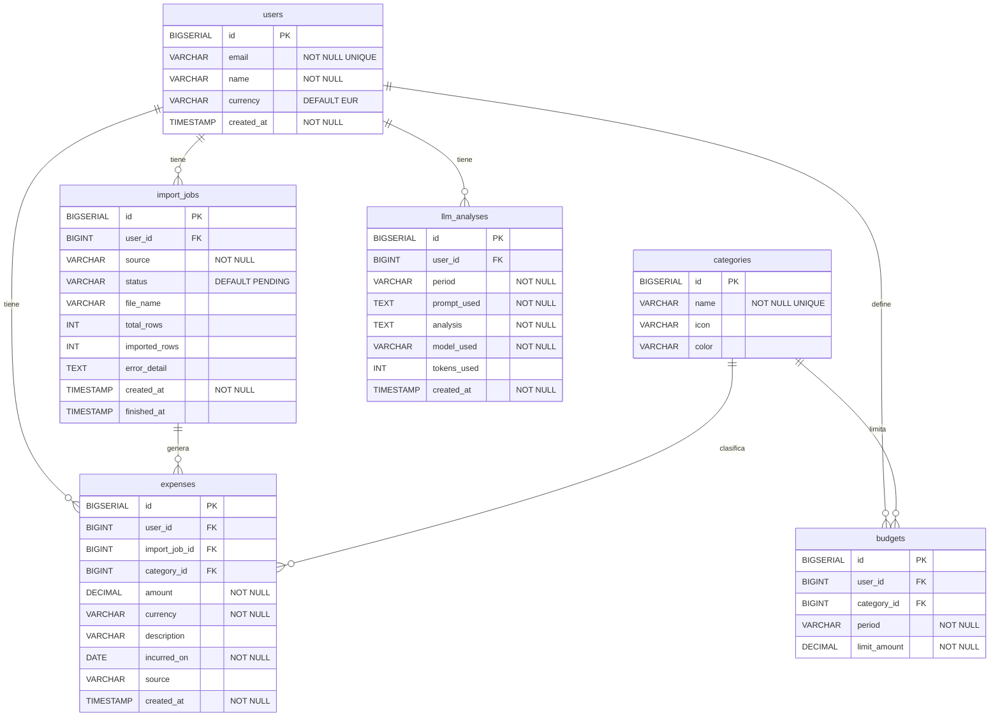

# Modelo de Datos — Aureus

## Diagrama Entidad-Relación


 
---

## Descripción de tablas

### `users`
Tabla central del sistema. Todas las demás tablas referencian `user_id`. El campo `currency` guarda la moneda preferida del usuario para no tener que inferirla gasto a gasto.

| Campo | Tipo | Restricciones |
|---|---|---|
| `id` | `BIGSERIAL` | `PRIMARY KEY` |
| `email` | `VARCHAR(255)` | `NOT NULL UNIQUE` |
| `name` | `VARCHAR(255)` | `NOT NULL` |
| `currency` | `VARCHAR(3)` | `NOT NULL DEFAULT 'EUR'` |
| `created_at` | `TIMESTAMP` | `NOT NULL DEFAULT NOW()` |
 
---

### `categories`
Normaliza las categorías para evitar inconsistencias (`"Groceries"` vs `"groceries"`). Se pre-pobla con las categorías estándar de Revolut. `icon` y `color` permiten personalizar la visualización en el dashboard.

| Campo | Tipo | Restricciones |
|---|---|---|
| `id` | `BIGSERIAL` | `PRIMARY KEY` |
| `name` | `VARCHAR(100)` | `NOT NULL UNIQUE` |
| `icon` | `VARCHAR(50)` | nullable |
| `color` | `VARCHAR(7)` | nullable — formato hex `#10b981` |
 
---

### `import_jobs`
Registra cada CSV subido por el usuario. Permite mostrar historial de importaciones y habilita la funcionalidad de "deshacer importación" borrando todos los gastos vinculados a un job concreto.

| Campo | Tipo | Restricciones |
|---|---|---|
| `id` | `BIGSERIAL` | `PRIMARY KEY` |
| `user_id` | `BIGINT` | `NOT NULL FK → users` |
| `source` | `VARCHAR(100)` | `NOT NULL` — `revolut`, `n26`, `manual` |
| `status` | `VARCHAR(20)` | `NOT NULL DEFAULT 'PENDING'` — `PENDING`, `PROCESSING`, `DONE`, `FAILED` |
| `file_name` | `VARCHAR(255)` | nullable |
| `total_rows` | `INT` | nullable |
| `imported_rows` | `INT` | nullable |
| `error_detail` | `TEXT` | nullable |
| `created_at` | `TIMESTAMP` | `NOT NULL DEFAULT NOW()` |
| `finished_at` | `TIMESTAMP` | nullable |
 
---

### `expenses`
El corazón del sistema. Cada fila es un gasto individual procedente de un CSV de Revolut o introducido manualmente. `import_job_id` es nullable para permitir gastos manuales sin CSV asociado.

| Campo | Tipo | Restricciones |
|---|---|---|
| `id` | `BIGSERIAL` | `PRIMARY KEY` |
| `user_id` | `BIGINT` | `NOT NULL FK → users` |
| `import_job_id` | `BIGINT` | nullable `FK → import_jobs` |
| `category_id` | `BIGINT` | `NOT NULL FK → categories` |
| `amount` | `DECIMAL(12,2)` | `NOT NULL` |
| `currency` | `VARCHAR(3)` | `NOT NULL` |
| `description` | `VARCHAR(500)` | nullable |
| `incurred_on` | `DATE` | `NOT NULL` |
| `source` | `VARCHAR(100)` | nullable |
| `created_at` | `TIMESTAMP` | `NOT NULL DEFAULT NOW()` |

**Índices:**
```sql
CREATE INDEX idx_expenses_user_month
    ON expenses(user_id, incurred_on);
 
CREATE INDEX idx_expenses_user_category
    ON expenses(user_id, category_id);
```
 
---

### `budgets`
Permite definir un presupuesto mensual por categoría. La restricción `UNIQUE (user_id, category_id, period)` garantiza que no existan dos presupuestos para la misma categoría en el mismo mes. Aporta contexto al análisis LLM: no solo "gastaste 340 €" sino "gastaste un 70% más de lo presupuestado".

| Campo | Tipo | Restricciones |
|---|---|---|
| `id` | `BIGSERIAL` | `PRIMARY KEY` |
| `user_id` | `BIGINT` | `NOT NULL FK → users` |
| `category_id` | `BIGINT` | `NOT NULL FK → categories` |
| `period` | `VARCHAR(7)` | `NOT NULL` — formato `yyyy-MM`, ej: `2025-03` |
| `limit_amount` | `DECIMAL(12,2)` | `NOT NULL` |

**Restricción única:**
```sql
UNIQUE (user_id, category_id, period)
```
 
---

### `llm_analyses`
Almacena la respuesta de OpenAI para evitar llamadas repetidas a la API. La restricción `UNIQUE (user_id, period)` garantiza un único análisis por usuario y mes. `prompt_used` guarda el prompt exacto enviado a GPT para trazabilidad y depuración.

| Campo | Tipo | Restricciones |
|---|---|---|
| `id` | `BIGSERIAL` | `PRIMARY KEY` |
| `user_id` | `BIGINT` | `NOT NULL FK → users` |
| `period` | `VARCHAR(7)` | `NOT NULL` — formato `yyyy-MM` |
| `prompt_used` | `TEXT` | `NOT NULL` |
| `analysis` | `TEXT` | `NOT NULL` |
| `model_used` | `VARCHAR(50)` | `NOT NULL DEFAULT 'gpt-4.1'` |
| `tokens_used` | `INT` | nullable |
| `created_at` | `TIMESTAMP` | `NOT NULL DEFAULT NOW()` |

**Restricción única:**
```sql
UNIQUE (user_id, period)
```
 
---

## Relaciones

| Relación | Tipo | Significado |
|---|---|---|
| `users` → `import_jobs` | 1:N | Un usuario sube muchos CSVs |
| `users` → `expenses` | 1:N | Un usuario tiene muchos gastos |
| `users` → `budgets` | 1:N | Un usuario define muchos presupuestos |
| `users` → `llm_analyses` | 1:N | Un usuario tiene un análisis por mes |
| `import_jobs` → `expenses` | 1:N | Un CSV genera muchos gastos |
| `categories` → `expenses` | 1:N | Una categoría clasifica muchos gastos |
| `categories` → `budgets` | 1:N | Una categoría puede tener presupuesto por mes |
 
---

## Migraciones Flyway

Las migraciones se encuentran en `src/main/resources/db/migration/` y se ejecutan en orden al arrancar la aplicación.

```
V1__create_users.sql
V2__create_categories.sql
V3__create_import_jobs.sql
V4__create_expenses.sql
V5__create_budgets.sql
V6__create_llm_analyses.sql
V7__seed_categories.sql
```